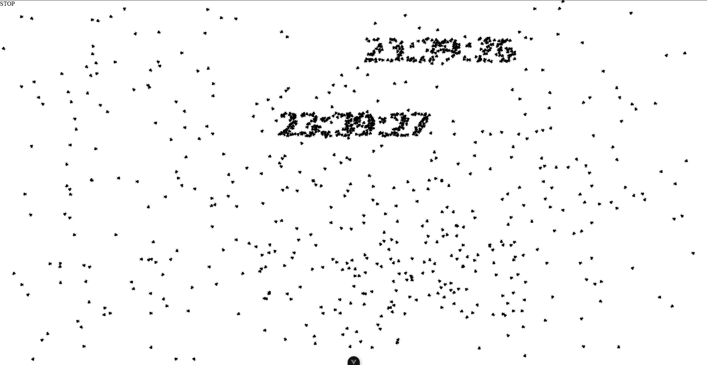

# Описание

Небольшой проект "по приколу".

Основная идея проекта - создание массива хаотично перемещающихся объектов,
способных в нужное время собираться в текст или изображение. Реализовано классом AnimationObject.

Для изображения текста на экране с помощью такого массива используется класс FlyText.

В качестве примеров использование - реализованы два варианта текстовых часов.



## Project Setup

```sh
npm install
```

### Compile and Hot-Reload for Development

```sh
npm run dev
```

### Type-Check, Compile and Minify for Production

```sh
npm run build
```

### Lint with [ESLint](https://eslint.org/)

```sh
npm run lint
```
